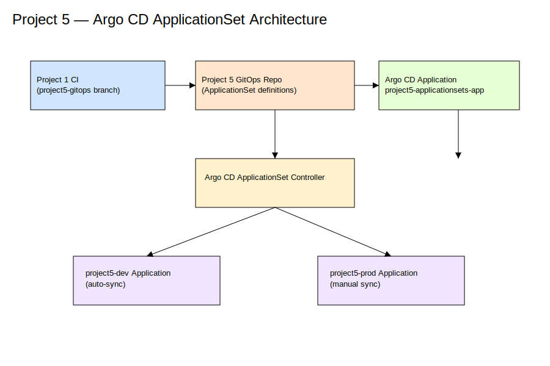

# Project 5 — Argo CD ApplicationSet GitOps Configuration



---

## 1. Overview

This repository defines an Argo CD ApplicationSet–based GitOps configuration that generates and manages environment-specific Argo CD Applications for dev and prod workloads.

It functions exclusively as a **GitOps configuration source**. Build, test, and image publication responsibilities are handled upstream. Argo CD continuously reconciles the desired state defined in this repository against the target Kubernetes cluster.

---

## 2. Repository Structure

```
project5-argocd-applicationset/
│
├── applications/
│   └── project5-applicationsets-app.yaml
│       # Argo CD meta-application managing ApplicationSets
│
├── applicationsets/
│   └── project5-applicationset.yaml
│       # ApplicationSet generating dev and prod Applications
│
├── docs/
│   ├── architecture.md
│   ├── applicationset-design.md
│   ├── argo-cd-configuration.md
│   ├── cicd-integration.md
│   ├── dev-prod-lifecycle.md
│   ├── references.md
│   └── images/
│       └── project5-architecture.svg
│
└── environments/
    ├── dev/
    │   └── values-dev.yaml
    └── prod/
        └── values-prod.yaml
```

The `environments/` directory is reserved for future value-file expansion and is not currently wired into the ApplicationSet.

---

## 3. Architecture Summary

- A single ApplicationSet definition generates distinct Argo CD Applications for dev and prod.
- Each generated Application deploys the same Helm chart sourced from the Project 4 repository.
- Environment separation is enforced through namespaces and Argo CD sync policies.
- Argo CD continuously reconciles state based on Git changes.

Detailed architecture is documented in **docs/architecture.md**.

---

## 4. ApplicationSet Model

The ApplicationSet is defined in:

```
applicationsets/project5-applicationset.yaml
```

Characteristics:

- Uses a list generator to define environment entries
- Produces one Argo CD Application per environment
- Shares a common Application template
- Injects environment-specific parameters declaratively

Generated Applications:

- **project5-dev**
  - Automated sync enabled
  - Reconciles immediately on Git changes

- **project5-prod**
  - Manual sync required
  - Reconciles only after explicit promotion

---

## 5. Argo CD Configuration

A meta-application manages all ApplicationSet resources:

```
applications/project5-applicationsets-app.yaml
```

This Application:

- Watches the `applicationsets/` directory
- Applies ApplicationSet changes automatically
- Enforces prune and self-heal behavior

Argo CD configuration details are documented in **docs/argo-cd-configuration.md**.

---

## 6. CI / GitOps Boundary

This repository does **not** define CI pipelines.

Image tags are updated upstream by an external CI system. Once committed, Argo CD detects the change and reconciles the generated Applications accordingly.

The CI/CD integration contract is documented in **docs/cicd-integration.md**.

---

## 7. Environment Lifecycle

- **Dev**
  - Automatic reconciliation
  - Continuous delivery behavior

- **Prod**
  - Manual reconciliation
  - Explicit promotion required

This separation enforces controlled promotion while maintaining configuration parity.

Further details are documented in **docs/dev-prod-lifecycle.md**.

---

## 8. Namespace Strategy

Applications deploy into isolated namespaces:

```
project5-dev
project5-prod
```

Namespaces are created automatically using:

```
syncOptions:
  - CreateNamespace=true
```

This ensures environments are reproducible and self-contained.

---

## 9. References

Official documentation for all components is listed in **docs/references.md**.
